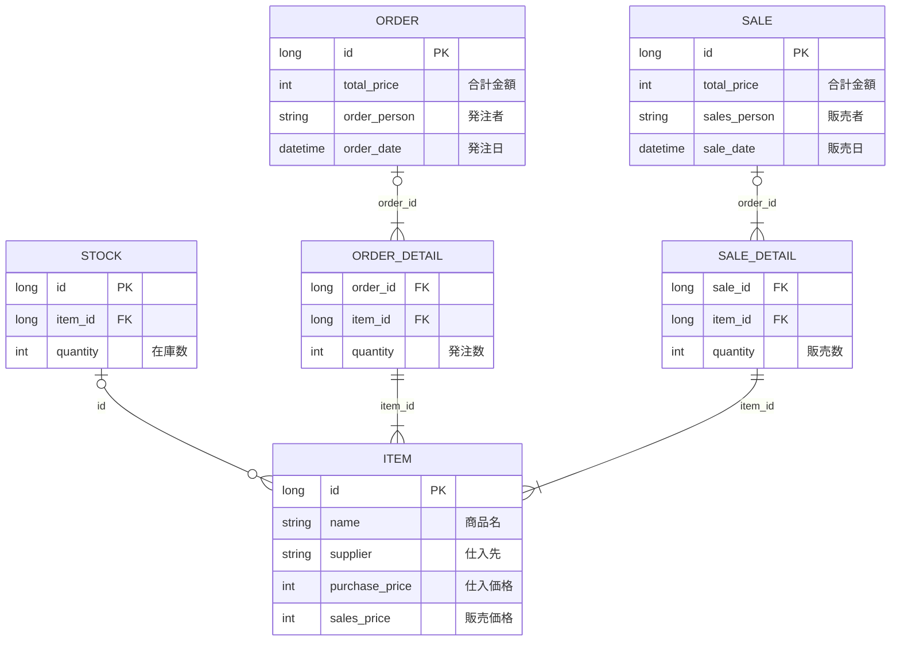

## SpringBoot の在庫管理システム習作
- 商品管理…商品の登録、更新、削除
- 在庫管理…在庫数、合計仕入価格の算出
- 販売管理…販売数、販売価格の算出
- 発注管理…発注数、仕入価格の算出

```mermaid
erDiagram
STOCK|o--o{ITEM:id
ORDER|o--|{ORDER_DETAIL:order_id
ORDER_DETAIL||--|{ITEM:item_id
SALE|o--|{SALE_DETAIL:order_id
SALE_DETAIL||--|{ITEM:item_id

%% 在庫テーブル
STOCK {
  long id PK
  long item_id FK
  int quantity "在庫数"
}

%% 発注テーブル
ORDER {
  long id PK
  int total_price "合計金額"
  string order_person "発注者"
  datetime order_date "発注日"
}

%% 発注明細テーブル
ORDER_DETAIL {
  long order_id FK
  long item_id FK
  int quantity "発注数"
}

%% 販売テーブル
SALE {
  long id PK
  int total_price "合計金額"
  string sales_person "販売者"
  datetime sale_date "販売日"
}

%% 販売明細テーブル
SALE_DETAIL {
  long sale_id FK
  long item_id FK
  int quantity "販売数"
}

%% 商品テーブル
ITEM {
  long id PK
  string name "商品名"
  string supplier "仕入先"
  int purchase_price "仕入価格"
  int sales_price "販売価格"
}
```
