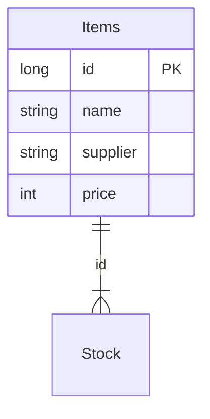

## SpringBoot の在庫管理システム習作
- 商品管理…商品の登録、更新、削除
- 販売管理…数量と販売価格の合計額算出、販売テーブルとの連携
- 発注管理…在庫数量の増減管理

```mermaid
erDiagram
Items||--|{Stock:id
Items {
long id PK
string name
string supplier
int price
}
```
